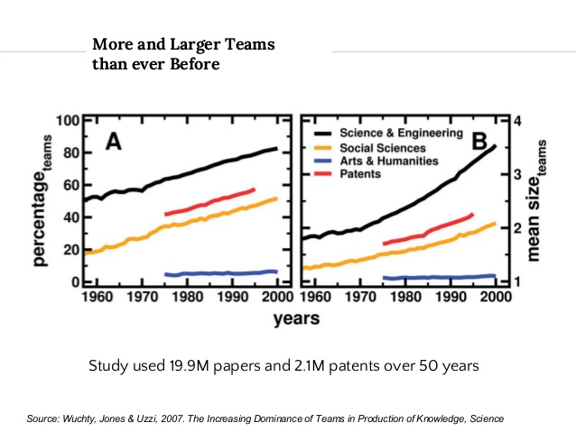
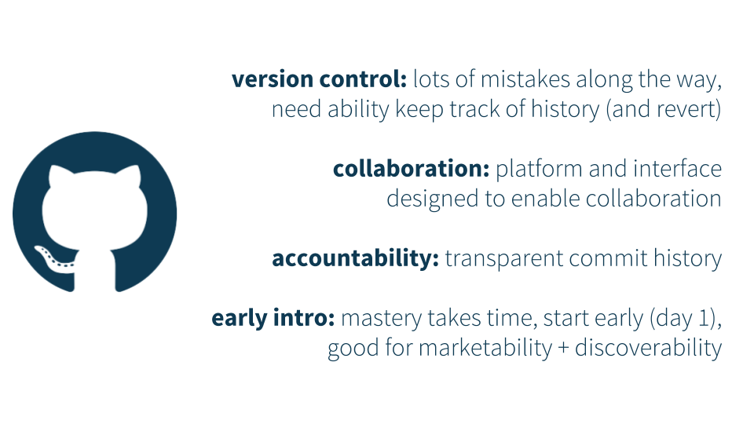

```{r setup, include=FALSE}
options(htmltools.dir.version = FALSE)
```


# an increasingly collaborative world 

.center[]


---
# tools


.footnote[<hr>we’ll git there, slowly but surely. mine çetinkaya-rundel. duke university statistical science
]


---
# utility of GitHub



.footnote[<hr>we’ll git there, slowly but surely. mine çetinkaya-rundel. duke university statistical science
]


---
# collaboration tools

.center[
    
    
    
]


---
# collaboration with GitHub

.center[]


---
# real-world example: cross-site soil organic matter synthesis

.center[]
