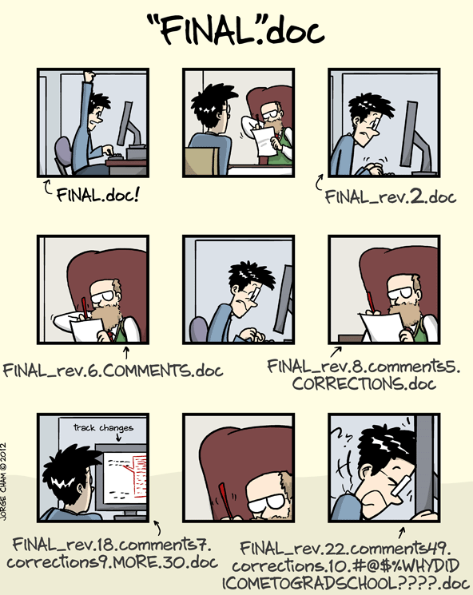
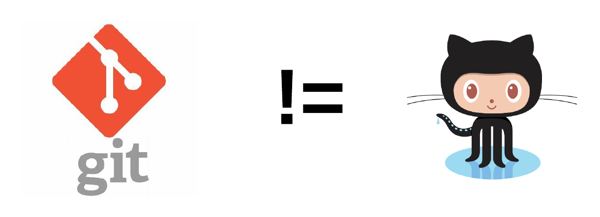
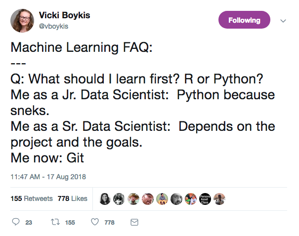
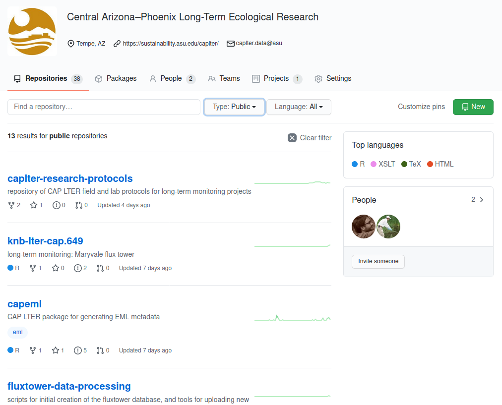
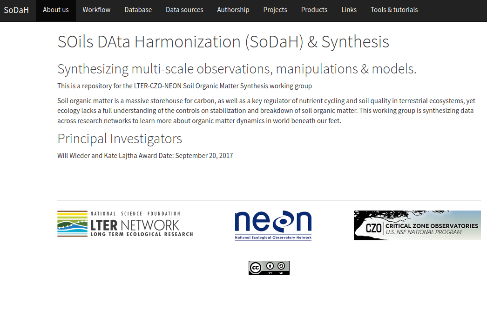

```{r setup, include=FALSE}
options(htmltools.dir.version = FALSE)
```

class: inverse

.center[
  
]

???

#### final document


---

<br>

**what it is.small[.light-blue[<sup>1</sup>]]:**

  * an open source, distributed version control system designed for speed and efficiency

<br>

**what it does.small[.light-blue[<sup>2</sup>]]:**

  * watches repositories (like a directory) for changes
  
  * asks that you describe changes when they are made
  
  * identifies conflicts, and forces you to resolve them


.footnote[
  .light-blue[<sup>1</sup>][Scott Chacon](https://speakerdeck.com/schacon/introduction-to-git?slide=13)<br>
  .light-blue[<sup>2</sup>][Jeff Goldsmith](https://speakerdeck.com/jeffgoldsmith/dsi-git-and-github)
]

???

#### what is it?


---
class: middle, center



???

#### git != github


---
class: middle, center


???

#### github one of many


---
#### git organization

* the repository (think directory) is the fundamental organizational unit

.center[
  </img>
]


---

#### GitHub organization

* repositories can be .gunmetal[**public**] (public, controlled write access) or .bean-red[**private**]

* repository owner can provide write access to other accounts

* **organizations** can link many accounts
  + accounts within organizations can be organized into **teams** for additional organization and access control

.center[
  </img>
]


---

#### synchronization and collaboration with GitHub

.pull-left[
  </img>
]

.pull-right[
<br>
  </img>
]


---

#### on stability ...

<br>

.center[
  </img>
]


---
class: inverse, center, middle



???
#### vicky on git


---
class: center, middle


---
class: inverse

#### CAP LTER

.less-left[
* manage code
  + applications
  + packages

* project management
  + long-term monitoring programs

* documentation:
  + informatics
  + protocols
]

.more-right[
  
]


---
class: inverse

#### SoDaH: soil synthesis working group

relative to the CAP LTER, far more emphases on communication

.less-left[
* manage code
  + applications
  + packages

* project management
  + issues

* communication
  + issues
  + website
]

.more-right[
  <br>
  
]


---

#### teaching

<br>

.center[
  
]


---

#### tools

.center[
  
]


---
background-image: url(assets/figures/challenge.jpeg)
background-size: cover
class: bottom, center

## .gunmetal[by a country mile, getting others on board !]

<br>
<br>
<br>
