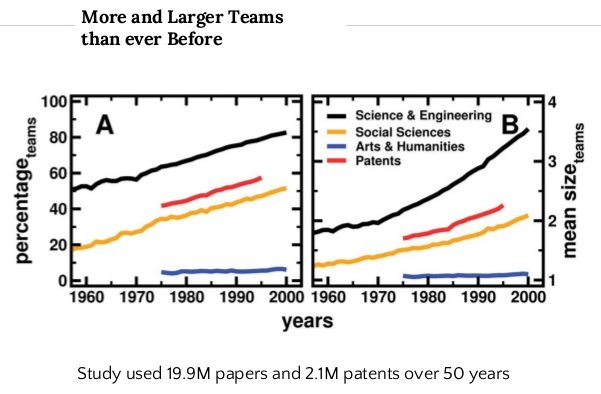
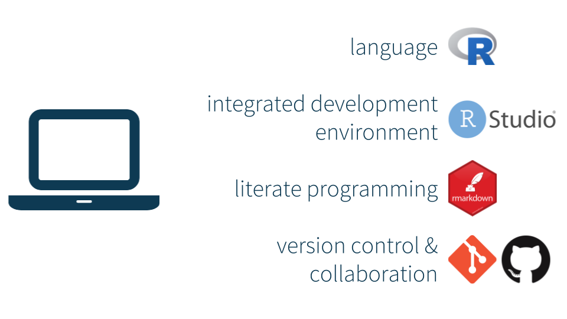
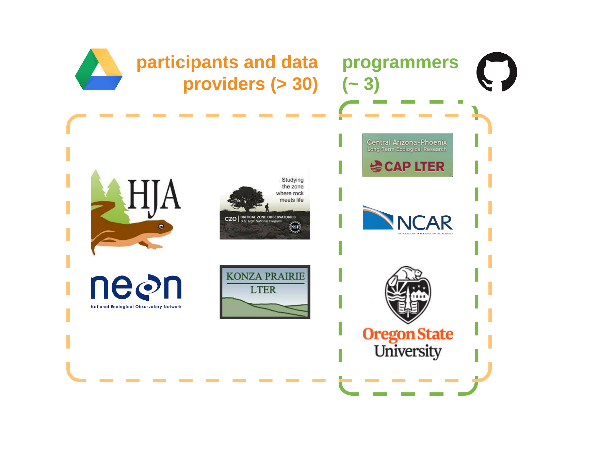

```{r setup, include=FALSE}
options(htmltools.dir.version = FALSE)
```


#### an increasingly collaborative world 

.center[]


---

#### tools



.footnote[<hr>we’ll git there, slowly but surely. mine çetinkaya-rundel. duke university statistical science]


---

#### utility of GitHub


.footnote[<hr>we’ll git there, slowly but surely. mine çetinkaya-rundel. duke university statistical science]


---

#### collaboration tools

.center[
    
    
    
]


---

#### collaboration with GitHub

.center[]


---

#### real-world example: cross-site soil organic matter synthesis

.center[]
